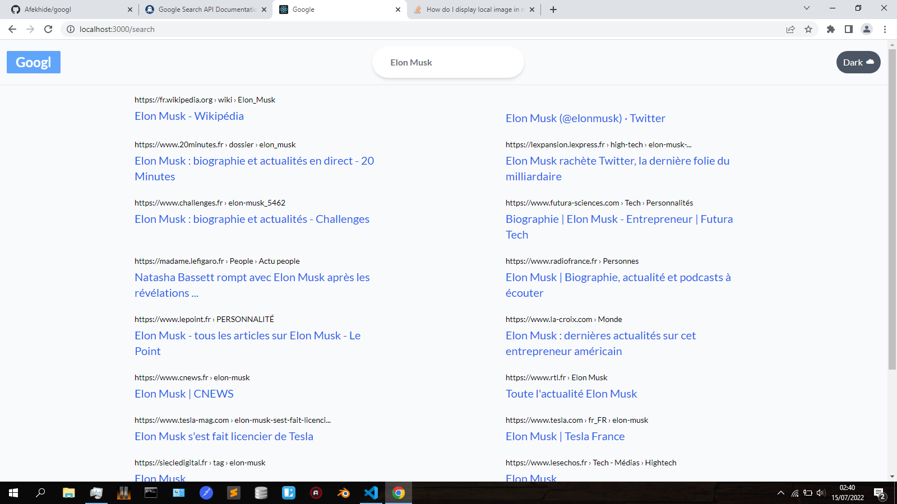

# **Googl Search 2.0**
This project was created following a tutorial from [Javscript Mastery](https://www.youtube.com/watch?v=NDbruK1fzG8).In this project I implemented a very minimalist version of the Google Search Home view.
Some of the things I learned  from the tutorial include

- Working with an API from Rapid API
- Using React Context API for managing global states
- A good knowledge of how to use TailwindCSS for creating responsive sites



## **Tech Stack**
1. React
1. Tailwindcss
2. Rapid API


## **Usage**
1. Clone this repository
1. cd in root directory, then run ```npm install```
1. Create a ***.env*** file within the root directory of the project
2. paste in the following:  REACT_APP_API_KEY=<*your API key from [Rapid API](https://rapidapi.com/apigeek/api/google-search3)*>
3. Then ```npm run start``` for starting the React Application
<!--3. Run ```npm run watch:css``` for setting up Tailwind -->

You can find the live preview [here](https://es-googl.netlify.app)